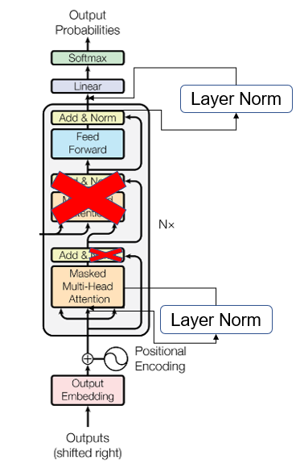
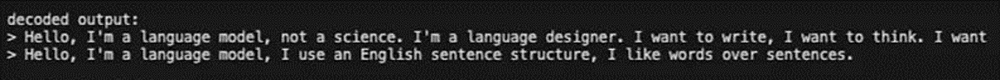
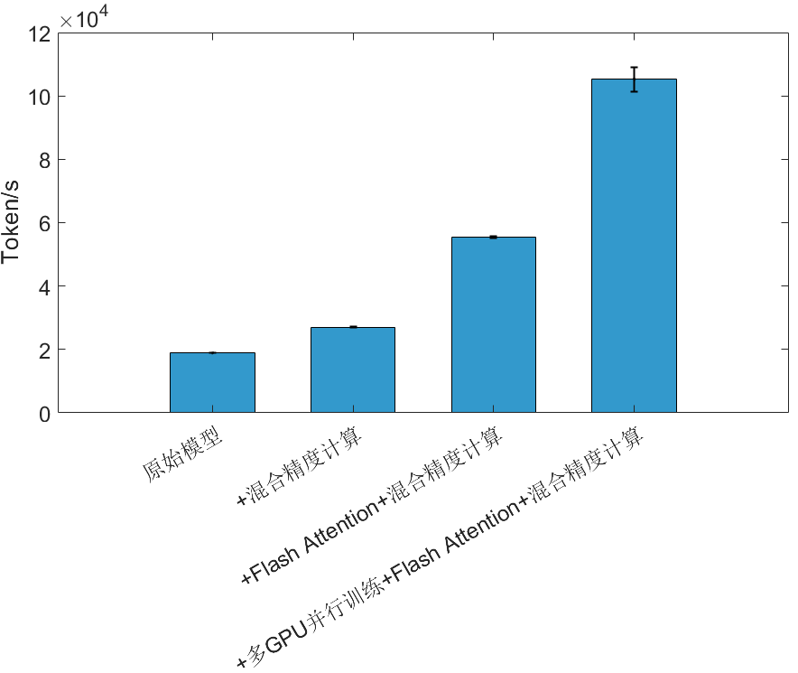

# Language Models are Few-Shot Learners

<p align="center">
• 🐱 <a href=" https://github.com/huggingface/transformers/blob/main/src/
 transformers/models/gpt2/modeling_gpt2.py" target="_blank">原文代码</a> 
• 📃 <a href="https://proceedings.neurips.cc/paper_files/paper/2020/file/1457c0d6bfcb4967418bfb8ac142f64a-Paper.pdf" target="_blank">原文</a>


## 摘要
在自然语言处理领域，传统模型通常需要大量为特定任务订制的标注数据集，这不仅导致过度最优化，还限制了跨任务的迁移能力。大规模自然语言模型，如GPT-2和GPT-3，通过预训练以及少量样本学习，能在众多自然语言处理任务中表现优秀。通过进一步提升模型规模和训练方案，这种模型带来了基础研究和实际应用的重大进展。同时，少样本学习提高了模型的跨领域和跨场景迁移能力，为不同场景下的实际问题提供了有效解决方案。本文基于GPT-2 的 Transformer 模型结构和 GPT-3 的训练超参数，搭建并预训练了GPT模型，并通过改进注意力机制等方法，在训练速度上提升了456.39%。原文在零样本设置下，在8个经过测试的语言建模数据集中的7个数据集上取得了最先进的结果。这些发现表明，构建能够从自然发生的演示中学习执行任务的语言处理系统是一种很有前景的方法。


## GPT模型介绍


GPT 模型只使用了Transformer的解码器部分，且模型在解码过程中并未包括与编码器之间的交叉注意力计算模块。这与传统的Transformer架构有所不同，在标准的Transformer中，解码器和编码器之间通过交叉注意力层进行信息交互，以便解码器能够利用编码器的输出进行生成。而在GPT模型中，由于其是个自回归生成模型，解码器部分的每一步生成仅依赖于先前的步骤，不需要与编码器交互。因此，GPT模型仅保留了解码器的自注意力机制。此外，GPT模型还在设计上做了一些改进，尤其是在层归一化（LayerNormalization）的位置上。传统的Transformer架构通常将层归一化应用于每个子层的输出端，但在GPT模型中，层归一化被移至每个子块的输入端。这种设计灵感来自于预激活残差网络（Pre-activation Residual Networks），其中层归一化和激活函数先于残差连接进行计算。这种设计有助于在训练过程中梯度传播，减缓梯度消失问题，从而促进更稳定的训练。在GPT 模型的架构末端，还增加了一个额外的层归一化模块，放置在最后一个自注意力模块之后。这一额外的层归一化层进一步增强了模型的稳定性，有助于减少模型训练中的不稳定因素，同时优化模型的最终输出表现。这些设计上的创新，可以进一步提升GPT模型的训练效率、稳定性以及生成效果。通过精心调整层归一化的位置，并剔除交叉注意力机制，GPT能够更高效地进行自回归生成任务，尤其是在大规模训练和推理时表现出更好的计算性能和稳定性。


## 文本生成示例


## 本文的复现和改进结果



## 运行这个项目

1. 创建一个新的 conda 或 python 虚拟环境并运行以下命令
```
pip install -r requirements.txt
```

2. 最后运行此项目。下面给出了一个示例：
```
单卡运行脚本： python train_gpt2.py
多卡运行脚本: torchrun --standalone --nproc_per_node={num_gpus} train_gpt2.py 或 python -m torch.distributed.launch --nproc_per_node={num_gpus} --master_port={port} train_gpt2.py
```


